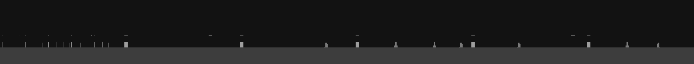
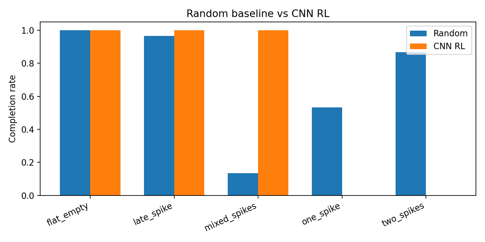
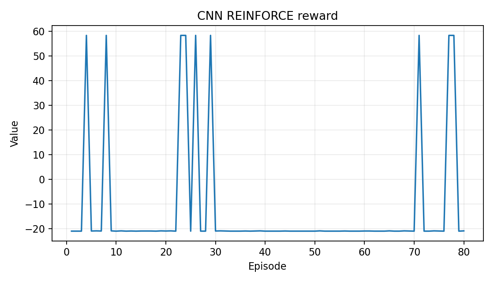
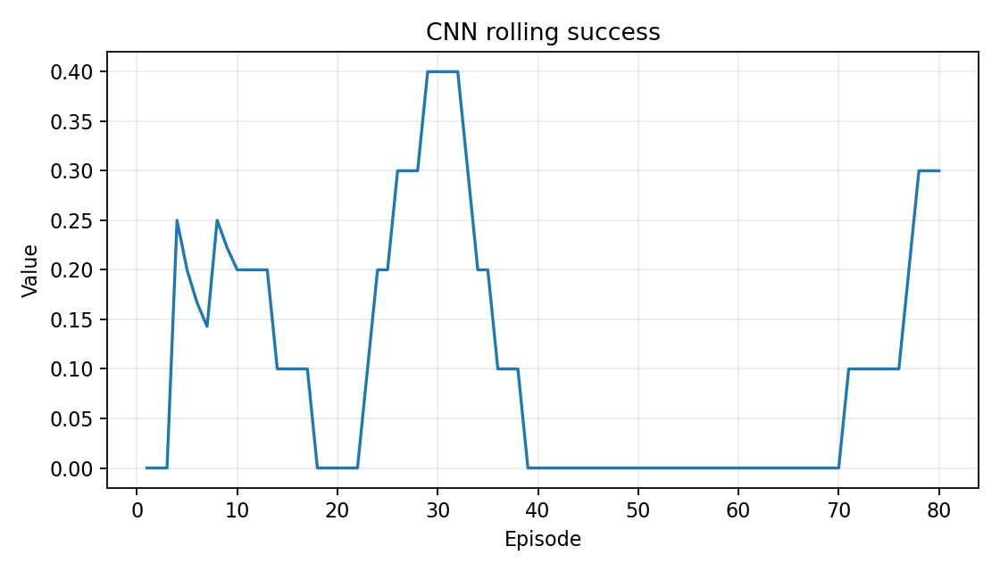

<!-- _class: lead invert -->

# Geometry Dash Vision RL Agent

#### CS231N Milestone 3 · Preliminary Results

Dorian Gulley · James Roberts · Naveen Kannan

---

# Environment Validation

**Goal.** Train a vision-only agent that maps one rendered game frame to jump/no-jump.

- Built a deterministic Pygame simulator with fixed-timestep physics.
- Corrected major physics bugs: grounded reset, configured jump velocity, triangular spike collisions, block side deaths, completion progress.
- Verified with 30 tests and visual contact sheets for rendered frames, model observations, and collision overlays.

---

# Preliminary Evaluation Setup

<!-- _style: "section { font-size: 32px; } h1 { font-size: 54px; }" -->

**Curriculum.** Five simple levels: flat, one spike, two spikes, late spike, mixed spikes.

**Observation.** Single grayscale image frame, shaped `(1, 96, 96)`.

**Policy.** Tiny CNN trained with REINFORCE.

**Baseline.** Random binary policy, 30 episodes per level.

**Metrics.** Completion rate, average progress, average reward.

---

# Results: Random vs CNN RL

**Finding.** Random is surprisingly strong on very easy levels because repeated jump attempts often clear simple spike layouts.

**CNN RL result.** The CNN solves some layouts but does not reliably solve the one-spike training level.

---

# Training Dynamics

<!-- _style: "section { font-size: 30px; } h1 { font-size: 56px; }" -->

**Takeaway.** REINFORCE sometimes succeeds but remains unstable; sparse timing rewards are the bottleneck.

---

# Analysis and Limitations

<!-- _style: "section { font-size: 29px; } h1 { font-size: 54px; }" -->

**Working so far.**

- Live visual observations, deterministic rollouts, and reproducible evaluation are working.
- Physics corrections are covered by targeted regression tests.

**Current limits.**

- CNN + REINFORCE is too noisy for stable jump timing.
- Random remains competitive because the starter levels are very forgiving.

---

# Next Steps

1. Add short frame history or optical-flow-like velocity cues.
2. Replace vanilla REINFORCE with PPO or actor-critic.
3. Tune curriculum so random is weak but solvable behavior remains clear.
4. Add rollout visualizations for learned policies.
5. Report mean ± std over multiple seeds.

**Milestone takeaway.** The environment and evaluation harness are working; the learning algorithm is the current bottleneck.
